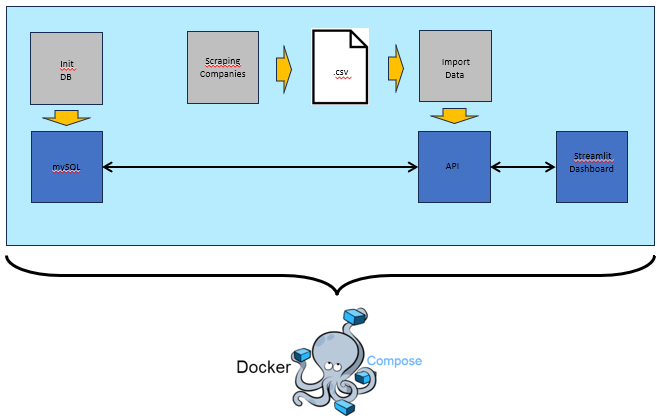

## Trustpilot Reviews

This project was done as a portfolio project as part of the Data Engineering Bootcamp at DataScientest. The overiew of the project is shown in the image below.The scope of the project is the analysis of ratings and customer reviews of 6 largest home electronics online stores in Germany from trustpilot.com

The project consists of following components.
- Web scraping (Beautiful Soup)
- API (FastAPI)
- Database (mySQL)
- Dashboard (Streamlit)
- Containerization (Docker Compose)

