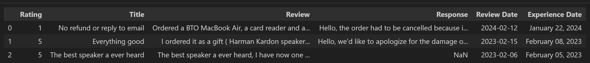

# Discovery of available data sources
As a starting point the scope of the project is to practice the skills taught in the Data Engineering Bootcamp hosted by DataScientest. The project's first step is scraping review data on companies from trustpilot.com. The following section describes the different data sources and gives examples of collected data. 

The companies selected for the project are six of the largest e-commerce companies in the area of consumer electronics operating on the German market: Cyberport, Mediamarkt, Coolblue, Mindfactory, Alternate and Saturn. All of these conpanies have at least 10.000 reviews in different languages. Two sets of data are scraped:
- company information: overall score as a number with one decimal point, number of reviews in all languages, and the percentages of review scores (1 to 5 stars)
- reviews in English: scores, text, the company's comment to review, the date of experience, and the date the review was posted.
  
It is important to note the overall score is not the average review score. Rather it is Trustpilot's evaluation made using internal, not fully disclosed, criteria, for more detailed information see: [here](https://support.trustpilot.com/hc/en-us/articles/201748946-TrustScore-and-star-rating-explained?_gl=1%2A9w0h1z%2A_ga%2AMTAzODY4NTg1NC4xNzA3MTY2NTg3%2A_ga_11HBWMC274%2AMTcwODAyNDg2Mi4yNS4xLjE3MDgwMjQ5MDguMTQuMC4w).

The reason only reviews in English are considered is that in the coming steps of the project language models are used to investigate the review text, whereby these models are available mostly for the English language.

Company information is scraped and stored in a Pandas dataframe and exported to csv, the data is shown in the image below.

Similarly, the review information data is stored in a Pandas dataframe with each review being a single datapoint. 
For 6 companies 3362 reviews are scraped. In the image below 5 top rows of the dataframe are shown corresponding to 5 latest reviews.

